```mermaid
mindmap
  root((Benefits of SQL Views))
    
    Security & Privacy
      🔒 Column-Level Security
        Hide sensitive data (salaries, personal info)
        Show only necessary columns
      👥 Role-Based Access
        Different views for different user roles
        Student workers vs. administrators
    
    Simplification
      🔧 Complex Query Packaging
        Wrap multi-join queries into simple views
        Hide underlying database complexity
      📋 Consistent Reporting
        Standardized calculations for everyone
        Single source of truth for metrics
    
    Data Independence
      🛡️ Schema Change Protection
        Apps keep working when tables change
        Update views instead of application code
      🔄 Logical Data Organization
        Present logical structure vs physical storage
        Create business-friendly interfaces
    
    Customization
      🎯 Tailored Presentations
        Department-specific views (Sales, Accounting)
        Role-specific data perspectives
      📊 Aggregate Views
        Pre-calculated summaries (totals, averages)
        Frequently used reports ready-to-go
    
    Maintenance
      📝 Centralized Logic
        Update business rules in one place
        No need to change multiple applications
      🧹 Clean Code Organization
        Reduce SQL code duplication
        More maintainable database structure
    
    Performance (Considerations)
      ⚡ Materialized Views
        Store pre-computed results for speed
        Refresh strategies for fresh data
      ⚠️ Limitations
        Not always updatable
        Can impact performance if overused
```

# 📊 Benefits of Using Views in SQL - Complete Guide

## 🎯 What Are Views?

**Views are saved SQL queries** that act like virtual tables. They don't store data themselves but provide a specific way of looking at your existing data. Think of them as **custom lenses** for your database!

## 🏗️ Basic View Syntax

```sql
-- Creating a simple view
CREATE VIEW student_directory AS
SELECT student_id, first_name, last_name, email
FROM students;

-- Using the view
SELECT * FROM student_directory;
```

## 🌟 Key Benefits of Views

### 1. 🔒 **Security & Access Control**
**Problem:** Different users need different data access levels.

**Solution:** Create tailored views for each user type.

```sql
-- For student workers (no sensitive data)
CREATE VIEW public_student_info AS
SELECT first_name, last_name, email, department
FROM students;

-- For administrators (full access)
CREATE VIEW admin_student_info AS
SELECT student_id, first_name, last_name, email, gpa, birth_date
FROM students;
```

**🎯 Benefit:** You control exactly what data each person can see!

### 2. 👓 **Simplified Complexity**
**Problem:** Complex queries with multiple joins are hard to write repeatedly.

**Solution:** Package complexity into a view.

```sql
-- Complex query made simple
CREATE VIEW student_report_cards AS
SELECT 
    s.first_name || ' ' || s.last_name AS student_name,
    c.course_name,
    g.grade,
    t.name AS teacher_name
FROM students s
JOIN grades g ON s.student_id = g.student_id
JOIN courses c ON g.course_id = c.course_id
JOIN teachers t ON c.teacher_id = t.teacher_id;

-- Now everyone uses the simple version!
SELECT * FROM student_report_cards WHERE student_name = 'Emma Johnson';
```

### 3. 🛡️ **Data Consistency**
**Problem:** Different people calculate metrics differently.

**Solution:** Standardize calculations in views.

```sql
CREATE VIEW monthly_sales AS
SELECT 
    EXTRACT(YEAR FROM order_date) as year,
    EXTRACT(MONTH FROM order_date) as month,
    SUM(amount) as total_sales,
    COUNT(*) as number_of_orders,
    ROUND(AVG(amount), 2) as average_order_value
FROM orders 
GROUP BY year, month;

-- Everyone gets the same numbers!
SELECT * FROM monthly_sales WHERE year = 2023;
```

### 4. 🔄 **Logical Data Independence**
**Problem:** Database changes break applications.

**Solution:** Use views as a buffer between apps and tables.

```sql
-- Original view
CREATE VIEW customer_info AS
SELECT customer_id, first_name, last_name, email
FROM customers;

-- Table structure changes, but view protects applications
ALTER TABLE customers ADD middle_name VARCHAR(50);

-- Update view instead of changing all apps
CREATE OR REPLACE VIEW customer_info AS
SELECT customer_id, first_name, middle_name, last_name, email
FROM customers;

-- Applications keep working without changes! 🎉
```

### 5. 🎨 **Customized Data Presentation**
**Problem:** Different departments need different data perspectives.

**Solution:** Create department-specific views.

```sql
-- Sales team view
CREATE VIEW sales_dashboard AS
SELECT 
    product_name,
    category,
    quantity_sold,
    total_revenue,
    region
FROM products p
JOIN sales s ON p.product_id = s.product_id;

-- Inventory team view  
CREATE VIEW inventory_status AS
SELECT
    product_name,
    current_stock,
    reorder_level,
    supplier_name
FROM products p
JOIN suppliers sup ON p.supplier_id = sup.supplier_id;
```

## 📊 Real-World Examples

### Example 1: School Database
```sql
-- View for teachers: Their students' grades
CREATE VIEW my_students_grades AS
SELECT 
    s.first_name,
    s.last_name,
    c.course_name,
    g.grade,
    g.assignment_date
FROM students s
JOIN grades g ON s.student_id = g.student_id
JOIN courses c ON g.course_id = c.course_id
JOIN teachers t ON c.teacher_id = t.teacher_id
WHERE t.teacher_id = CURRENT_USER_ID();  -- Only show current teacher's students
```

### Example 2: E-commerce Store
```sql
-- View for customers: Their order history
CREATE VIEW my_order_history AS
SELECT
    o.order_id,
    o.order_date,
    p.product_name,
    oi.quantity,
    oi.price,
    o.status
FROM orders o
JOIN order_items oi ON o.order_id = oi.order_id
JOIN products p ON oi.product_id = p.product_id
WHERE o.customer_id = CURRENT_USER_ID();  -- Security built-in!
```

## ⚠️ Important Considerations

### Performance Implications
- **Simple views** = Usually good performance
- **Complex views** with multiple joins = Potential slowness
- **Materialized views** = Store data physically (faster but needs refreshing)

### Updatability
- **Simple views** on single tables = Usually updatable
- **Complex views** with joins/aggregates = Often read-only

```sql
-- This will probably work:
UPDATE student_directory SET email = 'new.email@school.edu' WHERE student_id = 1;

-- This will probably FAIL:
UPDATE student_report_cards SET grade = 'A+' WHERE student_name = 'Emma Johnson';
```

## 🚀 Best Practices

1. **Use descriptive names**: `student_directory` not `view1`
2. **Document your views**: Add comments explaining their purpose
3. **Avoid over-nesting**: Don't create views that use other views excessively
4. **Consider indexing**: For frequently used complex views
5. **Regular cleanup**: Remove unused views

## 💡 Advanced: Materialized Views

For better performance with complex data:

```sql
-- Materialized view (stores actual data)
CREATE MATERIALIZED VIEW monthly_sales_summary AS
SELECT 
    EXTRACT(YEAR FROM order_date) as year,
    EXTRACT(MONTH FROM order_date) as month,
    SUM(amount) as total_sales,
    COUNT(*) as order_count
FROM orders
GROUP BY year, month;

-- Refresh when needed (manual or scheduled)
REFRESH MATERIALIZED VIEW monthly_sales_summary;
```

## 📝 Summary: When to Use Views

| Situation | Benefit |
|-----------|---------|
| 🔒 Different user access levels | Security |
| 🔧 Complex frequent queries | Simplification |
| 📊 Standard reporting | Consistency |
| 🛡️ Database changes expected | Data independence |
| 🎯 Department-specific needs | Customization |

## 🎓 Your Action Plan

1. **Identify complex queries** you write repeatedly
2. **Find sensitive data** that needs protection
3. **Look for inconsistent calculations** across reports
4. **Start creating views** for these situations!
5. **Share views** with your team instead of complex SQL

Remember: **Views make your database more secure, consistent, and maintainable!** 🚀